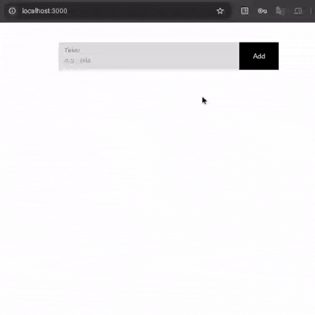

# TradingViewDataScraper

Fetches live price data from TradingView and streams it to a client in real time, so you can watch the live price of any coin you need.



## Overview

This is a small full-stack monorepo:

- **`apps/server`** — a backend service that scrapes/fetches live data from TradingView (using Playwright) and exposes it over a [ConnectRPC](https://connectrpc.com/) API.
- **`apps/client`** — a React frontend that connects to the server and displays the live price data.
- **`proto/`** and **`gen/`** — Protobuf definitions (`connectrpc/price/v1`) and the generated client/server code, built with [Buf](https://buf.build/).

## Tech Stack

- **Language:** TypeScript
- **Frontend:** React
- **Backend:** Node.js, Playwright (for scraping live TradingView data)
- **RPC layer:** ConnectRPC + Protocol Buffers (Buf codegen)
- **Package manager:** pnpm (workspaces)
- **Dev environment:** Nix flake (optional)

## Project Structure

```
.
├── apps/
│   ├── server/     # Backend: scrapes TradingView, serves data via ConnectRPC
│   └── client/     # Frontend: React app that displays live price data
├── proto/
│   └── connectrpc/price/v1/   # Protobuf service definitions
├── gen/
│   └── connectrpc/price/v1/   # Generated code from the proto definitions
├── buf.yaml / buf.gen.yaml    # Buf configuration for codegen
├── run.sh                     # Convenience script to codegen + run both apps
├── package.json                # Root workspace scripts
└── pnpm-workspace.yaml
```

## Getting Started

### Prerequisites

- [Node.js](https://nodejs.org/) (LTS recommended)
- [pnpm](https://pnpm.io/)
- (Optional) [Nix](https://nixos.org/) if you want to use the provided `flake.nix` dev environment

### Installation

```bash
git clone https://github.com/VenkataSaiKumar07/TradingViewDataScraper.git
cd TradingViewDataScraper
pnpm install
```

### Generate Protobuf/ConnectRPC code

```bash
pnpm run codegen
```

### Run the app

The easiest way is the provided shell script, which handles codegen, installs Playwright browsers if needed, and starts both the server and client:

```bash
./run.sh
```

Or run each piece manually:

```bash
# Backend (http://localhost:8080)
pnpm run server

# Frontend (http://localhost:3000)
pnpm run client
```

Once both are running, open **http://localhost:3000** in your browser to see live coin price data streaming in.

## Scripts

| Script | Description |
|---|---|
| `pnpm run codegen` | Generates ConnectRPC/Protobuf code via Buf |
| `pnpm run server` | Starts the backend server (`apps/server`) |
| `pnpm run client` | Starts the frontend client (`apps/client`) |

## License

ISC
